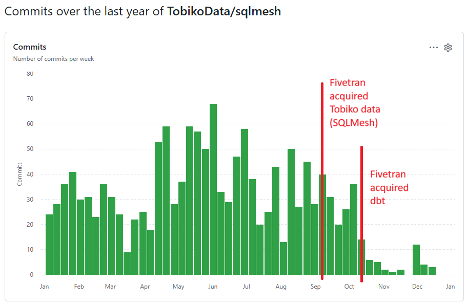

# Known issues

While creating this demo SQLMesh repo, I ran into several issues with SQLMesh: bugs,
annoyances, or things where I didn't fully understand why they weren't behaving the way
I expected them to.

I collected those issues here and the workarounds I used.

## `sqlmesh ui` is deprecated, but its replacement is still experimental (and buggy)

There is a command `sqlmesh ui` that starts the SQLMesh UI. However, this is deprecated.
When you run that command you get the warning:

> [WARNING] The UI is deprecated and will be removed in a future version. Please use the
> SQLMesh VSCode extension instead. Learn more at https://sqlmesh.readthedocs.io/en/stable/guides/vscode/

However, the recommended replacement, the VSCode extension, is still in preview and
buggy:

> The SQLMesh Visual Studio Code extension is in preview and undergoing active
> development. You may encounter bugs or API incompatibilities with the SQLMesh
> version you are running.

The VSCode extension has significantly fewer features and functionality, but worse, it
crashes frequently:

### SQLMesh VSCode extension crashes

When enabling the SQLMesh extension, everything works until I run a `sqlmesh` command
in the terminal. Any command, even just `sqlmesh --help`, makes the VSCode extension
crash and give error messages (Error: Client got disposed and can't be restarted).
Restarting the VSCode extension (F1 > SQLMesh: Restart Servers) or reloading the window
(F1 > Developer: Reload Window) fixes it temporarily, until the next `sqlmesh` terminal
command.

Strangely, running `sqlmesh` commands via either a Jupyter notebook (using `!`) or via
`uvx` (`uvx sqlmesh`) does not cause this crash. I do not know what causes the issue,
but as a workaround, this playground aliases `sqlmesh` to `uvx sqlmesh`.

## Models with model kind "FULL" not always materialized

A model with kind "FULL" is the simplest type of model. It is similar to materialization
"table" in dbt. When refreshing, the whole table should be recreated in full. There
should be no incremental updates or other complex temporal logic.
So data intervals should at most determine _when_ a model gets recalculated (or skipped),
but otherwise should not have any effect on the data.

However, that is not the case. When creating, changing, or restating a model with kind
FULL, and then doing a run with an interval that is either:

* before the model's start date, or
* smaller than the model's interval_unit

Then the run is successful without warnings, but the model is materialized without data
(0 rows).

I reported this bug as a Github issue:
https://github.com/TobikoData/sqlmesh/issues/5236

(update December 2025) In the latest version of sqlmesh, this situation also runs into
an error where sqlmesh does not create the underlying table but still tries to point a
view to it, which gives an error:
https://github.com/TobikoData/sqlmesh/issues/5612

## Poor interaction with DuckDB's READ_JSON

This project uses DuckDB's `READ_JSON` function to read (zipped) json's from online URLs
with the source data (Github events). This was the cause of a lot of frustration:

* When SQLMesh "runs" an incremental model, it first creates an empty table with the
  right data types, then fills it up with data for each interval. To create the empty
  table, SQLMesh runs the SQL for a data interval at 1970-01-01 with `limit 0`. Since
  there is no source data for 1970-01-01, this fails with an HTTP 404 error. We have to
  manually use `@if` logic to make SQLMesh do something else when creating a model:
  * Initially I just changed the date to a date for which there is data. However, there
    were several instances where interacting with SQLMesh was slow because it was
    actually fetching large json's, just to parse/visualize/plan/display lineage.
  * I ultimately settled for using a dummy SELECT statement with only nulls instead,
    but that still has some issues:
    * It requires specifying the columns explicitly (either via casting or via the
      [columns property](https://sqlmesh.readthedocs.io/en/stable/concepts/models/overview/#columns)).
      Unlike dbt's contracts, these columns are not checked. If the real data does not
      match these column specifications, the docs say you get undefined behavior.
    * If you change the URL, SQLMesh does not think the model changed.

To be fair, these issues are not bugs or flaws in SQLMesh itself. SQLMesh tries to parse
and understand your SQL queries to e.g. derive column names and data types, but that is
just not possible with DuckDB's READ_JSON. This model is doing ingestion, not transformation
(in dbt terms we're not doing the "T" in ETL), via non-standard SQL functions, so some
rough edges are expected.

## Error messages

In general, when something goes wrong with SQLMesh's internals, the error messages are
often not great. A good example is [Github issue 5612](https://github.com/TobikoData/sqlmesh/issues/5612),
where the error message is
```
Execution failed for node SnapshotId<"full_model_using_cron_expression": 2815714217>
```

## Hard-coded prod-only behavior

In Git, there's nothing special about the `main` (or `master`) branch. You can impose
restrictions yourself, such as branch restrictions in Github, but these are not hard-
coded in Git itself.

In SQLMesh, prod is hard-coded as a special environment in *many* ways. To a certain
extent it's good to have some extra protections for production environments enabled by
default, but in SQLMesh these are not defaults: SQLMesh treats prod differently from
other environments in many ways and you can't change this.

This is annoying in a few ways:

- You might want to apply some of these protections or special logic to other branches
  (e.g. QA or acceptance), or you might even have multiple production environments, or
  you might want to use SQLMesh's virtual data environments to cheaply have multiple
  versions/releases of your data in different schemas, which all should be treated
  as "prod". None of that is possible.
- You might want to test some of this special-case logic (e.g. so-called "forward-only"
  plans, not using Virtual Data Environments, `sqlmesh audit`), but that's
  also not possible.
- If audits (data tests) fail, the behavior for production (using `sqlmesh run` - a
  command that does not support passing any other environment than prod) is
  Write-Publish-Audit instead of Write-Audit-Publish with `sqlmesh plan` (see
  https://sqlmesh.readthedocs.io/en/latest/concepts/audits/#plan-vs-run).
- Overall the many ways prod is treated specially are quite confusing.

However, where it becomes really problematic is that some bugs exist only in production,
see e.g. https://github.com/TobikoData/sqlmesh/issues/5640

Because of the bug above, I simply don't use `prod` in this whole repo, I use only the
environments `dev` and `acc`.

### `--execution-time` is ignored in `sqlmesh plan` only in prod (not in dev)

As mentioned in the previous section, there are some bugs that exist only in prod:

When using the flag `--execution-time` to run a project as of a certain date, e.g.
using the passed argument as "now" (especially useful in combination with Airflow),
subsequent runs of `sqlmesh plan` ignore the `--execution-time` variable only in prod,
not in any other environments.

Bug reported here: https://github.com/TobikoData/sqlmesh/issues/5640

## Release & commit frequency

While not a technical bug per se, it is quite concerning that since Fivetran acquired
dbt Labs on 2025-10-13, the number of commits to sqlmesh fell off a cliff:



Source: https://github.com/TobikoData/sqlmesh/graphs/commit-activity

Interestingly, the commit frequency didn't drop when Fivetran bought Tobiko Data (the
creators of SQLMesh) but when they bought dbt Labs, 1 month later.

Similarly, while SQLMesh famously released new versions very frequently, with multiple
releases a week, even sometimes multiple in one day, this also changed. In November 2025
there was 1 release (which only fixed 1 bug).

## Audits of incremental models

When you configure audits (data tests) for an incremental model and then do a `sqlmesh plan`,
only the data of the interval you specify is tested. For some data tests this makes sense
(e.g. `not_null`) and is a useful optimization. For other data tests (e.g. no duplicate ids)
you might want the test to be run only on that interval, but you might also want the whole
table to be checked. In SQLMesh, you cannot do the latter in any environment other than prod:
there is a command `sqlmesh audit` but you can only run this in prod, not in any other
environments.

## DuckDB lock

This is not a bug but it was an annoying issue to deal with due to using DuckDB as the DWH:
A DuckDB database can only be attached to one process at the same time (when writing).
This means that when using the DuckDB UI (`duckdb -ui` or `make ui`) or Notebooks with
`%%sql%` syntax, you can't then run `sqlmesh` commands to modify the database.

Therefore, in this repo, I:

- Don't really use `duckdb -ui` but use notebooks instead to explore data
- Had to write a wrapper function to query DuckDB while only attaching the db for the
  duration of that query (see `exercises/notebook_utils.py`)

### `sqlmesh fetchdf` is quite primitive and is not configurable

SQLMesh contains the command `sqlmesh fetchdf` to run a query on the configured DWH.
I initially tried to use this to do data exploration instead of the above 2 options,
but this command is very basic: it crops the data (in the displayed output) when you
have more than a given hard-coded number of rows, columns, or when values are longer
than a certain length (SQLMesh uses the Pandas default Dataframe display output),
and there are no configuration options or flags to change this behavior.
I don't use `fetchdf` anymore.

## `.sql` file extension for models

Similarly to dbt, SQLMesh uses .sql as the extension for models. But these models are
not sql files since they also contain e.g. macros and other syntax (MODEL in SQLMesh).
Other extensions such as SQLTools get confused by this and wrongly try to add syntax
highlighting or other features when you have a `.sql` file open.

In `.vscode/settings.json` I added
```
{
    "sqltools.codelensLanguages": [],
    "sqltools.completionLanguages": []
}
```
to disable syntax highlighting of SQLTools. It works 90% of the time, but for some
unknown reason not always.

## DuckDB views & attaching databases

This is a minor annoyance:

When using DuckDB as the data warehouse, SQLMesh creates views in the virtual layers
that "point to" (using `SELECT * FROM`) the tables in the physical layer. These views
use the fully-qualified name `persistent` as the catalog name. The default catalog name
that DuckDB uses when attaching a database is the database name (here `local`), so
when attaching the database using the "common" DuckDB commands (`duckdb local.duckdb`
or using the defaults in the UI) you get a "binder error" when querying these views
because the catalog `persistent` does not exist.

To work around this, you must attach `local.duckdb` as alias `persistent` explicitly
(e.g. `ATTACH 'local.duckdb' AS persistent;`).

## Ctrl-C is slow

When SQLMesh is running in the terminal, you can use Ctrl-C to stop/cancel the plan/run,
but this often takes many (30+) seconds to respond, no matter how many times you press
Ctrl-C. I often resorted to forcefully killing the process instead, and while I
understand that you may not want to do this when running on a real DWH/state connection,
the UX of having to wait this long to stop a run is still bad.
